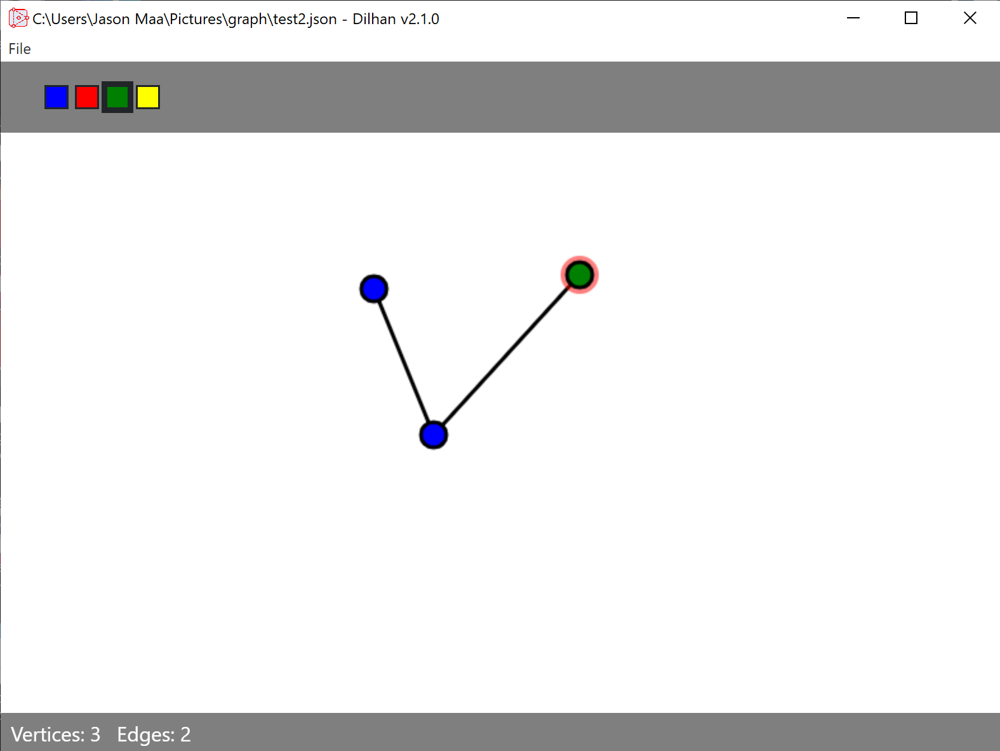

# Dilhan

Dilhan is a tool for creating and analyzing undirected graphs.

## Usage

Download `jar` file from latest release and run `java -jar <JAR NAME>`

## Features
  - Create and modify undirected graphs
  - Save and load graph files
  - Count vertices and edges